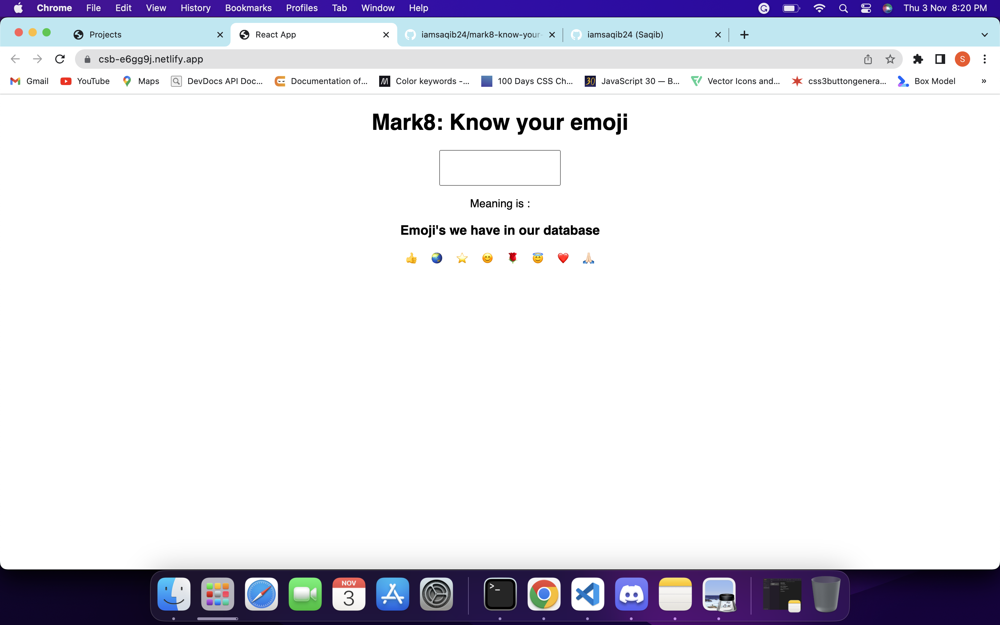

# Mark8-Know-Your-Emoji

This is basic react app which i built on CodeSandBox. It takes emoji as input from the user and checks it with the existing database of emojis. if it found then returns its meaning and if not found then give message "we don't have this emoji in our database."

## Technologies i used to build this:

1. HTML
2. CSS
3. ReactJS

---

## Project is live, to check [click here](https://csb-e6gg9j.netlify.app/ "Know Your Emoji")

## Image

